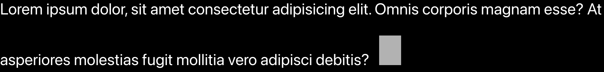

# react-chatgpt-typewriter

Animate your texts with a typing effect inspired by ChatGPT.

## Installation

```sh
npm i react-chatgpt-typewriter
```

## React

### Declaration

```typescript
type ChatGPTTypewriterEffectProps = {
  text: string;
  delay?: number;
  fill?: string;
  width?: number;
  height?: number;
  hideWhenFinished?: boolean;
  onChange?: (text: string) => void;
  onFinished?: () => void;
};
declare const ChatGPTTypewriterEffect: React.FC<ChatGPTTypewriterEffectProps>;
export default ChatGPTTypewriterEffect;
```

### Usages

```typescript
App.css
-------
.App {
 font-size: 3rem;
}

App.tsx
-------
import './App.css';
import ChatGPTTypewriterEffect from 'react-chatgpt-typewriter';
function App() {
  return (
    <div className="App">
      <ChatGPTTypewriterEffect
        delay={50}
        width={'2em'}
        height={'3em'}
        marginLeft="1em"
        onFinished={() => {
          console.log('Text writed');
        }}
        text="Lorem ipsum dolor, sit amet consectetur adipisicing elit. Omnis corporis magnam esse? At asperiores molestias fugit mollitia vero adipisci debitis?"
      />
    </div>
  );
}
export default App;
```

### Screen


